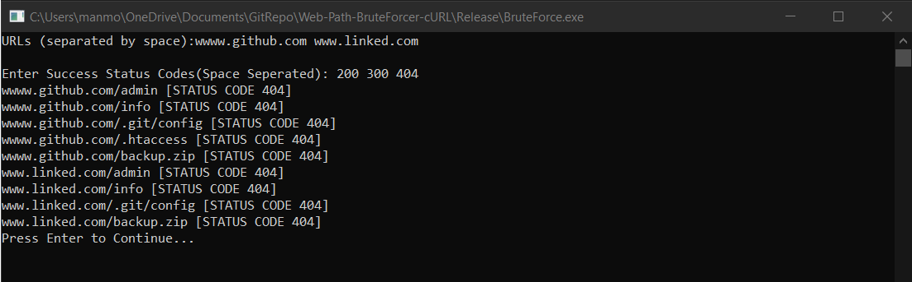

# Web-Path-BruteForcer-cURL
#### A simple Web Path Bruteforcer using C++ Request: [cURL](https://github.com/whoshuu/cpr) for People wrapper built on top of [libcurl](https://curl.se/libcurl/). 

##### The CLI interface accepts these from the user:

• Webapp urls(can be multiple, space seperated) 
• A file containing a list of webapp paths that need to be brute forced against the specified 
• List of success status code according to user 

##### Sample Input: 

Webapp urls: https://www.github.com 
Webapp paths: (sample 5 lines out of the input file wordlist.txt) 

• admin 
• info 
• .git/config 
• .htaccess 
• backup.zip 

Success status codes(needs to be space seperated): 200 302 

##### Sample Output:

A list of URLs that responded with any of the success status codes as provided in
the input by the user. 

• https://www.github.com/info [Status code 302] 
• https://www.github.com/.htaccess [Status code 200] 

## Usage:

1) Clone repo to local machine.
2) Go to '[release](Release/)' folder.
- By default there is '[wordlist.txt](Release/wordlist.txt)' file containing wordlist which can be replaced with another text file having same name.
3) Run BruteForce.exe.

## Screenshot

